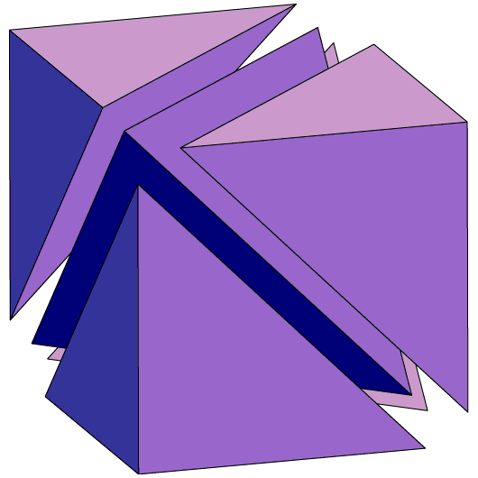
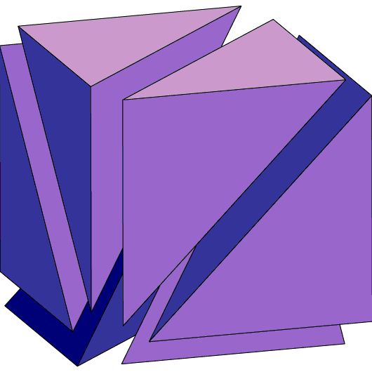
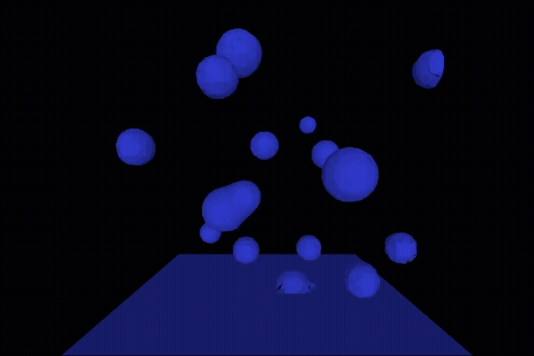
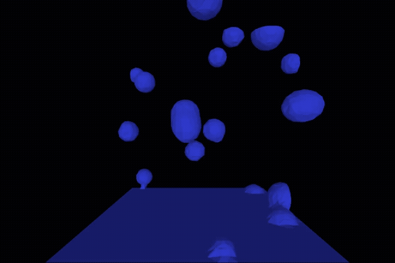
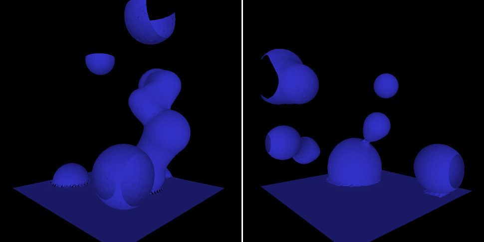

# Metaballs

## Présentation

Dans ce répertoire, vous trouverez un code réalisé en binôme durant ma première année du master **ISICG**. L’objectif était d’implémenter et d’afficher une surface de *metaballs* à l’aide de la technique de **Marching Tetrahedra**.

Pour faire simple les *metaballs* sont des objets définis par un champ de potentiel : chaque sphère influence son environnement, et la surface finale correspond à l’iso-valeur où l’ensemble des influences se combinent. Cela permet d'obtenir des formes organiques, lisses et qui fusionnent naturellement les unes avec les autres. Et pour ce qui est du **Marching Tetrahedra**, c'est une technique d’extraction de surface iso-valuée, similaire au Marching Cubes mais sans ambiguïtés topologiques. Elle consiste à paver l'espace 3D avec une grille régulière de cube puis on viens découper chaque cube en **5 ou 6 tétraèdres**. Ensuite on va determiner pour chaque tétraèdres comment l'isovalue traverse les sommets pour reconstruire les triangles correspondant et voila.

| Découpage en 5 tétrahèdres | Découpage en 6 tétrahèdres | Isovalue reconstruction | 
| - | - | - |
|  |  |  |

## Résultats

| Découpage en 5 tétrahèdres | Découpage en 6 tétrahèdres | 
| - | - |
|  |  |

